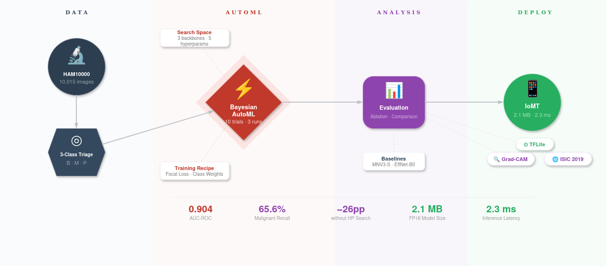

# 🔬 Mobile AutoML for Skin Lesion Triage on IoMT Devices

[](https://www.intconfair.com/)
[](LICENSE)
[](https://www.python.org/)
[](https://www.tensorflow.org/)
[](https://colab.research.google.com/github/YOUR_USERNAME/mobile-automl-skin-triage/blob/main/Mobile_AutoML_Skin_Triage_Pipeline.ipynb)

---

## Overview

This repository contains the complete experimental pipeline for a conference paper that benchmarks **Automated Machine Learning (AutoML)** against manually designed lightweight architectures for **three-class skin lesion triage** (benign / malignant / precancerous). Models are quantised for deployment on **Internet of Medical Things (IoMT) edge devices** and interpreted via **Grad-CAM explainability**.

<p align="center">
  
</p>

### Key Results

| Model | Params | Accuracy | Recall (mal.) | AUC-ROC |
|:------|:------:|:--------:|:-------------:|:-------:|
| **AutoML-MNV3L** | 3.1M | 0.800 | 0.656 | **0.904** |
| MobileNetV3-S | 1.0M | 0.819 | 0.662 | 0.905 |
| EfficientNet-B0 | 4.2M | 0.779 | 0.552 | 0.873 |

- **Ablation study:** removing automated HP search drops malignant recall by **26 percentage points**
- **Quantisation:** MobileNetV3-Small at FP16 → **2.1 MB**, **2.3 ms** per image on CPU
- **External validation:** ISIC 2019 (n=3,000) — accuracy 61.5%, AUC-ROC 0.725

---

## Repository Structure

```
mobile-automl-skin-triage/
├── Mobile_AutoML_Skin_Triage_Pipeline.ipynb   # Full reproducible pipeline (Colab)
├── README.md
├── LICENSE
├── requirements.txt
├── figures/
    ├── Figure1.png          # Pipeline architecture diagram
    ├── Figure2.png          # Class distribution
    ├── Figure3.png          # Confusion matrices
    ├── Figure4.png          # Ablation study bar chart
    ├── Figure5.png          # Accuracy vs model size scatter
    └── Figure6.png          # Grad-CAM heatmaps
```

---

## Quick Start

### Prerequisites

- **Google Colab Pro** (recommended: L4 or T4 GPU runtime)
- **Kaggle API key** ([get one here](https://www.kaggle.com/settings))

### 1. Clone the repository

```bash
git clone https://github.com/YOUR_USERNAME/mobile-automl-skin-triage.git
```

### 2. Upload your Kaggle credentials

Place your `kaggle.json` file at:
```
/MyDrive/YOUR_PROJECT/config/kaggle.json
```

### 3. Run the pipeline

Open the notebook in Colab and select **Runtime → Run all**.

- **First run:** ~3–3.5 hours (training + evaluation)
- **Cached rerun:** ~15–20 minutes (all checkpoints load from Google Drive)

---

## Pipeline Description

The notebook is structured into 14 sequential cells:

| Cell | Description | Output |
|:----:|:------------|:-------|
| 0 | Environment setup, GPU check, Drive mount | Configuration |
| 1 | Download HAM10000 via Kaggle API | 10,015 images |
| 2 | Three-class triage remapping (benign/malignant/precancerous) | Class distribution |
| 3 | Image loading and preprocessing (224×224, normalised to [0,1]) | NumPy cache |
| 4 | Stratified train/val/test split by `lesion_id` | 8,037 / 1,000 / 978 |
| 5 | Data augmentation pipeline (`tf.data`) | Augmented batches |
| 6 | **AutoML search** — Bayesian optimisation over mobile architectures | Best model (.keras) |
| 7 | Baseline 1 — MobileNetV3-Small (transfer learning) | Trained model |
| 8 | Baseline 2 — EfficientNet-B0 (transfer learning) | Trained model |
| 9 | Comparative evaluation + ablation study | Tables + figures |
| 10 | TFLite quantisation (FP32, FP16, INT8) | .tflite models |
| 11 | Grad-CAM explainability | Heatmap figure |
| 12 | External validation on ISIC 2019 | Cross-dataset metrics |
| 13 | Publication-ready figures (300 dpi) | PNG + PDF figures |
| 14 | Final summary and experiment log | JSON log |

### Caching

Every computationally expensive step saves its output to Google Drive. If a session disconnects, simply reconnect and re-run — completed steps load from cache instantly.

---

## Methodology

### AutoML Search Space

| Dimension | Values |
|:----------|:-------|
| Backbone | MobileNetV3-Small, MobileNetV3-Large, EfficientNet-B0 |
| Fine-tuned layers | 0, 20, 40 |
| Dense units | 64, 128, 256 |
| Dropout rate | 0.2, 0.3, 0.4, 0.5 |
| Learning rate | 10⁻³, 5×10⁻⁴, 10⁻⁴ |

The search is constrained to **mobile-friendly architectures** (no ResNet-50, EfficientNet-B7, etc.) to enforce IoMT deployment feasibility. Keras Tuner with Bayesian Optimisation explores 10 trials; the best configuration is retrained 3 times with different seeds, and the run with the highest validation AUC-ROC is selected.

### Class Imbalance Handling

- **Focal loss** (γ=2.0) with per-class α weights
- **Inverse-frequency class weights:** benign=0.41, malignant=2.05, precancerous=10.21

### Triage Mapping

| Triage Class | Original HAM10000 Categories | Clinical Action |
|:-------------|:-----------------------------|:----------------|
| Benign | NV, BKL, DF, VASC | No urgent action |
| Malignant | MEL, BCC | Urgent referral |
| Precancerous | AKIEC | Monitoring / follow-up |

---

## Results

### Ablation Study

| Configuration | Accuracy | Recall (mal.) | Macro Recall | AUC-ROC |
|:--------------|:--------:|:-------------:|:------------:|:-------:|
| Full pipeline | 0.800 | 0.656 | 0.772 | 0.904 |
| − Focal loss | 0.877 | 0.656 | 0.718 | 0.894 |
| − Class weights | 0.765 | 0.701 | 0.759 | 0.894 |
| − HP search | 0.729 | **0.396** | 0.609 | 0.830 |

### Quantisation

| Model | Quant. | Size | Accuracy | Latency (ms) |
|:------|:------:|:----:|:--------:|:------------:|
| AutoML-MNV3L | FP16 | 6.2 MB | 0.818 | 7.2 |
| **MobileNetV3-S** | **FP16** | **2.1 MB** | **0.832** | **2.3** |
| EfficientNet-B0 | INT8 | 5.1 MB | 0.814 | 15.5 |

---

## Datasets

This pipeline uses two publicly available datasets:

- **HAM10000** ([Kaggle](https://www.kaggle.com/datasets/kmader/skin-cancer-mnist-ham10000)) — 10,015 dermatoscopic images, 7 diagnostic categories
  - Tschandl, P., Rosendahl, C. & Kittler, H. *The HAM10000 dataset.* Sci. Data 5, 180161 (2018).

- **ISIC 2019** ([Kaggle](https://www.kaggle.com/datasets/andrewmvd/isic-2019)) — 25,331 images, 8 diagnostic categories (used for external validation only)

> **Note:** Datasets are downloaded automatically via the Kaggle API during the first run.

---

## Requirements

```
tensorflow>=2.19.0
keras-tuner>=1.4.0
scikit-learn>=1.4.0
numpy>=1.26.0
pandas>=2.2.0
matplotlib>=3.8.0
seaborn>=0.13.0
```

Full dependency installation is handled automatically in Cell 0 of the notebook.

---

This project is licensed under the MIT License — see the [LICENSE](LICENSE) file for details.

---

## Acknowledgements

The experiments were conducted on Google Colab Pro with NVIDIA L4 GPU. The authors thank the maintainers of the HAM10000 and ISIC 2019 datasets for making their data publicly available.
